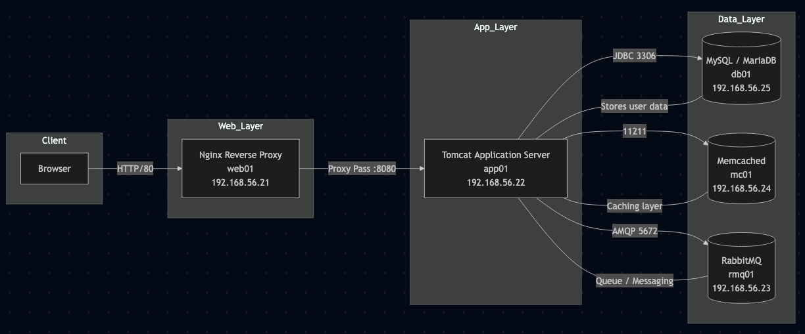
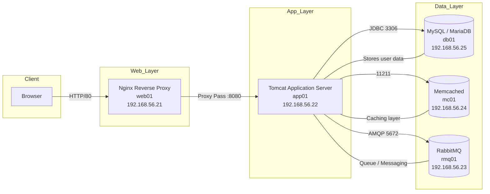

# VirtualAppDevops

## 📋 Table of Contonts
- [Overview](#-overview)
- [Architecture Diagram](#-architecture-diagram)
- [Prerequisites](#-prerequisites)
- [Installation](#-installation)
- [Deployment Methods](#-deployment-methods)
- [Application Access](#-application-access)


---
## 📌 Overview

This project provides a complete multi-tier DevOps environment using **Vagrant**, multiple virtual machines, and a distributed architecture including:

- Nginx (reverse proxy)
- Tomcat (Java application server)
- MySQL / MariaDB
- RabbitMQ
- Memcached
- ElasticSearch

It is designed as a real-world setup to practice DevOps, automation, provisioning, and distributed systems.


---

## 🏗️ Architecture Diagram

Voici l’architecture globale du projet :





---

## 🖥️ Prerequisites

This project was built and tested on **macOS M2 with VMware Fusion**.  
Make sure your environment is properly configured before continuing.

### Required Operating System
- macOS (Apple Silicon M1/M2)

### Virtualization Tools

#### 1. Rosetta
Open the terminal and execute the following command:
```bash
/usr/sbin/softwareupdate --install-rosetta --agree-to-license
```

#### 2. Vagrant
```bash
brew install vagrant
```

#### 3. VMware Fusion
- Download **VMware Fusion**
- Allow VMware Fusion in **Accessibility** under Security & Privacy Settings on your Mac

#### 4. Vagrant VMware Utility
```bash
brew install --cask vagrant-vmware-utility
```

#### 5. Vagrant VMware Desktop Plugin
```bash
vagrant plugin install vagrant-vmware-desktop
```

#### 6. Vagrant Hostmanager Plugin
```bash
vagrant plugin install vagrant-hostmanager
```

---

## ⚙️ Installation

### Clone the Project
```bash
git clone https://github.com/WahabBello/VitualAppDevops.git
cd VitualAppDevops/vagrant
```

---

## 🚀 Deployment Methods

This project offers two installation modes based on your needs.

### 🟢 Option 1: Automated Provisioning (Recommended)

All VMs and services will be configured automatically via provisioning scripts.

**Steps:**
```bash
cd Automated_provisioning
vagrant up
```

Once provisioning is complete, the application will be accessible.

---

### 🟡 Option 2: Manual Installation

To configure each VM and service step-by-step, follow the manual installation guide.

**This method includes:**
- Database installation
- Memcached configuration
- RabbitMQ setup
- Tomcat deployment
- Nginx reverse proxy configuration

👉 **Ideal for practicing infrastructure provisioning manually**

📖 Refer to the [Manual Installation Guide](./vagrant/Manual_provisioning/README.md)

---

## 🌐 Application Access

Once deployment is complete, access the web application at the following address:

**🔗 http://192.168.56.21**

---

## 📝 Notes

- Ensure all prerequisites are installed before running `vagrant up`
- The first run may take several minutes depending on your internet connection
- In case of issues, check the logs with `vagrant status` and `vagrant ssh [vm-name]`


